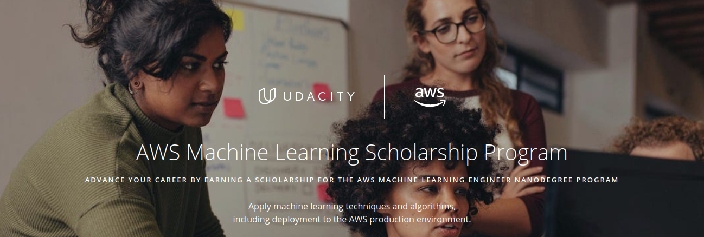

# AWS Machine Learning Foundations Scholorship

AWS and Udacity are collaborating to educate developers of all skill levels on machine learning concepts. Eligible students must be 18 years of age or older who are interested in expanding their machine learning skills and expertise to enroll in the AWS Machine Learning Scholarship Program. The goal for this program is to up-level machine learning skills to all, and to cultivate the next generation of ML leaders across the world, with a focus on underrepresented groups. Through its We Power Tech Program, AWS collaborates with professional organizations that are leading initiatives to increase the diversity and talent in technical roles, including organizations like Girls In Tech and the National Society of Black Engineers.

At the end of the AWS Machine Learning Foundations Course, learners will take an assessment from which top performers will be selected for one of 425 follow-up scholarships to one of Udacity’s most popular and recently refreshed Nanodegree programs: The AWS Machine Learning Engineer Nanodegree program.

❤| Udacity AWS Machine Learning Foundations Scholorship Program | Status
--- | ---| ---
1 | Welcome to the AWS Machine Learning Foundations Course | &#9745;
2 | Introduction to Machine Learning |  &#9746;
3 | Machine Learning with AWS |  &#9744;
4 | Software Engineering Practices, part 1 |  &#9744;
5 | Software Engineering Practices, part 2 |  &#9744;
6 | Object-Oriented Programming |  &#9744;
7 | AWS ML Foundations Assessment | &#9744;

## Status Definitions
 &#9744; Means that the particular Chapter is not started yet 👍  
 &#9746; Means that the particular Chapter is under progress 👨‍💻  
 &#9745; Means that the particular Chapter is completed 🎉

## Pre-requisites

* [Intro to Python Programming](https://www.udacity.com/course/introduction-to-python--ud1110)
* [Introduction to Machine Learning Course](https://www.udacity.com/course/intro-to-machine-learning--ud120)
* [Intro to Deep Learning with PyTorch](https://www.udacity.com/course/deep-learning-pytorch--ud188)
